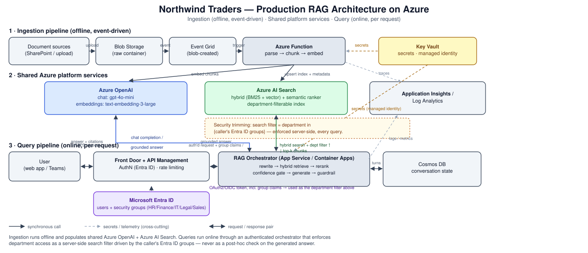

# Architecture

## 1. Diagram

Three lanes:

1. **Ingestion (offline, event-driven).** A document dropped in Blob Storage fires an Event Grid
   notification, which invokes an Azure Function that parses, section-aware-chunks, embeds
   (Azure OpenAI `text-embedding-3-large`), and upserts into Azure AI Search along with
   department/version/effective-date metadata.
2. **Shared platform services.** Azure OpenAI (chat + embeddings) and Azure AI Search
   (hybrid + semantic ranker) are used by both the ingestion path and the query path — one
   index, one model deployment, not duplicated per environment.
3. **Query (online, per request).** A user's request goes through Front Door + API Management
   (AuthN via Entra ID, rate limiting) to a stateless RAG Orchestrator (App Service / Container
   Apps) that does query rewrite → hybrid retrieval → rerank → confidence gate → generation →
   citation guardrail, then returns a grounded answer. Conversation state lives in Cosmos DB, not
   in the orchestrator's memory, so the service can scale horizontally.

Cross-cutting: Key Vault holds every secret and is accessed via managed identity (no keys in
code or app settings); Application Insights/Log Analytics collects traces from every hop for the
latency/debugging story in §4.

## 2. Why this architecture

**Why Azure AI Search (not a raw vector DB, not "just embeddings in a table")?**
Because the assignment's own failure scenarios — mixed relevance signals, department ACL,
versioned/conflicting documents — all need capabilities that live at the *retrieval* layer, not
just embeddings:
- Native **hybrid search** (BM25 + vector, fused server-side) instead of hand-rolling fusion.
- A managed **semantic ranker** (cross-encoder reranking) with no extra model to host.
- **Filterable/facetable fields** (`department`, `doc_family`, `effective_date`) so ACL and
  version resolution are enforced as a search-time filter, not app-side post-processing.
- It's already inside the Azure trust boundary (private endpoints, managed identity, same
  region as the rest of the stack) — one fewer system to secure and operate versus standing up
  and hardening a separate vector database.

**Semantic vs. vector vs. hybrid — which, and why?**
- **Vector-only** misses exact-term queries (policy names, tier names like "Enterprise Plus",
  dollar figures) where lexical match is exactly what's needed — cosine similarity on embeddings
  doesn't reliably privilege an exact token match over a paraphrase.
- **Keyword/semantic-only** (no vectors) misses paraphrase and synonym queries ("time off" vs.
  "leave", "cancel" vs. "termination") that don't share tokens with the source text.
- **Hybrid (BM25 + vector, fused, then semantically reranked)** is what's implemented here and
  is the right default for an internal knowledge base: short, jargon-heavy policy documents where
  both exact terms (tier names, dollar amounts, policy IDs) and paraphrase robustness matter. This
  is also Microsoft's own default recommendation for RAG-over-enterprise-docs scenarios.
  Reserve vector-only for content with little vocabulary overlap with likely queries (e.g.
  transcripts, casual chat logs) where hybrid's lexical half adds noise, not signal.

**Why an explicit confidence gate before generation, rather than trusting the LLM's judgment?**
Because "does the model think it knows the answer" and "does the retrieved context actually
support an answer" are different questions, and only the second is checkable mechanically before
spending a generation call. Gating on retrieval-side confidence is cheaper, faster, and doesn't
depend on the model reliably self-reporting uncertainty (which LLMs are not good at).

## 3. Scaling: 10,000 documents → 10 million (or 5 million, per Step 5 Q3)

At 10K documents (this assignment's scale, ~150 chunks total), a single Azure AI Search
**Basic/Standard S1** tier with one partition/replica handles the whole index; ingestion can run
as a single Azure Function invocation per document; embeddings cost is negligible; the local
hashing-embedding fallback in this repo is even viable for a demo.

At 10M+ documents, several things change, in this order of "what breaks first":

1. **Ingestion throughput.** A single Function per document stops being viable — move to a
   **batch pipeline** (Azure Data Factory or a queue-driven Function fan-out via Storage Queue/
   Service Bus) with idempotent upserts keyed on `doc_id + chunk_index`, so re-ingestion and
   partial failures are safe to retry.
2. **Search tier and partitioning.** Move to **Standard S2/S3 or a Storage-Optimized tier**, add
   partitions for both storage capacity and query throughput, and add replicas for query QPS and
   availability (partitions × replicas = search units). Consider splitting into **multiple
   indexes by department or business unit** rather than one giant index, if departments have very
   different query volumes or need independent scaling/schema evolution — the department filter
   in the schema here is what makes that split easy later (route at the orchestrator layer).
3. **Embedding cost and throughput.** At 10M docs, initial embedding is a multi-day batch job —
   use the **Azure OpenAI Batch API** (async, ~50% cheaper) rather than synchronous calls, and
   parallelize across many Function instances with backoff on 429s.
4. **Metadata/versioning at scale.** The hand-maintained `catalog.json` in this repo is fine for
   11 documents; at 10M it becomes a **metadata store** (Cosmos DB or a SQL table) driven by
   actual source-system signals (SharePoint columns, Git history for docs-as-code, a document
   management system's version API) rather than curation.
5. **Retrieval quality at scale.** More documents means more near-duplicate and stale content
   competing for top-k; **effective-date-aware ranking and the version-resolution fix from
   Scenario 3 matter more, not less**, and reranking (semantic ranker or an LLM-based rerank
   stage) becomes essential rather than a nice-to-have, since hybrid search alone returns
   noisier top-k as corpus size grows.
6. **Cost.** At this scale, embedding storage (vector index size) and semantic ranker calls
   dominate; see §7 (cost) below for the levers.

## 4. Step 5 — Architecture & Problem-Solving Questions

### Q1. Retrieval returns 5 chunks, only 1 relevant — how to debug and improve?

Debug in this order (cheapest checks first):
1. **Look at the actual retrieved text**, not just doc titles — is the *right document* being
   split so the relevant fact and the query's phrasing end up in different chunks (Scenario 1)?
   This repo's `src/ingestion/chunking.py` fixes this class of bug with section-aware chunking;
   the eval harness (`eval/evaluate.py`) exists specifically to catch a regression here.
2. **Check whether it's a retrieval problem or a ranking problem** — is the relevant chunk
   present in a wider candidate set (e.g. top-20) but not top-5? If yes, it's a **reranking**
   problem (add/tune the semantic ranker or the local lexical reranker in
   `src/retrieval/reranker.py`), not a recall problem.
3. **Check hybrid vs. vector-only** — disable BM25 (`use_hybrid_search=False`) and rerun; if
   recall improves, the query has exact-term signal vector similarity is diluting; if it drops,
   the query is paraphrase-heavy and vectors are carrying the recall.
4. **Check Top-K and chunk size** — Top-K too small starves the reranker of candidates; chunk
   size too large dilutes a specific fact inside a long chunk's embedding (lower similarity even
   when the fact is present).
5. **Check metadata filtering** — is an overly broad or missing department/version filter letting
   irrelevant candidates compete for the same top-k slots?

### Q2. Latency goes from 3s to 12s — how to find the bottleneck?

Don't guess — **every stage's wall-clock time is already recorded** on `RAGResult.timings_ms`
(`rewrite_ms`, `retrieve_ms`, `generate_ms`, `total_ms`; see `src/rag_pipeline.py`), and in
production this is exactly what Application Insights' dependency tracking gives you per request,
broken down by outbound call (Azure AI Search query, Azure OpenAI embedding call, Azure OpenAI
chat completion call). Concretely:
1. Pull the **P50/P95/P99 latency by dependency name** in App Insights over the regression
   window — a jump concentrated in one dependency (e.g. Azure OpenAI chat completions) points at
   a specific cause (model deployment under-provisioned TPM/RPM quota, a longer prompt from
   larger retrieved context, a noisy-neighbor throttling event) rather than a system-wide issue.
2. If it's spread evenly across all dependencies, suspect **infrastructure**: App Service/Container
   App under CPU/memory pressure (check autoscale metrics), a cold start after a scale-to-zero
   event, or DNS/network latency to a newly-provisioned region.
3. If it's specifically **retrieval**, check whether `top_k_retrieve` or the number of expanded
   multi-queries (Scenario 2's comparison-query expansion) grew — more sub-queries means more
   round trips to Azure AI Search.
4. If it's specifically **generation**, check the **prompt token count trend** — larger retrieved
   context (e.g. a chunk-size regression) increases prompt tokens, which increases both cost and
   latency roughly linearly for a fixed model.

### Q3. Scale from 10,000 → 5 million documents

See §3 above — same answer, cross-referenced here per the assignment's exact wording.

### Q4. Access-controlled RAG across departments (HR must never leak to Engineering)

Implemented in this repo as **security trimming enforced at the retrieval layer**, never as a
post-hoc filter on the generated answer:
- Every chunk carries a `department` field (`src/ingestion/pipeline.py`).
- Every request carries a `role` (in production: the caller's Entra ID group membership, passed
  as a validated claim from API Management/the orchestrator — see `src/access_control.py` for the
  role→department mapping, which is the same shape as the group→department mapping used in the
  diagram).
- `Retriever.retrieve()` passes `department_filter` straight into the vector store's `search()`
  call (`department eq 'HR' or department eq '...'` as an Azure AI Search OData filter, or an
  in-process filter in the local backend) — **the disallowed department's chunks are never
  fetched from the index at all**, so they can't reach the prompt, the generated answer, or a
  citation, even if the LLM or a bug downstream mishandles them.
- This is why the baseline profile (`use_department_acl=False`) is a good demonstration of the
  wrong way to do this: it retrieves without any filter and relies on nothing to stop cross-
  department leakage — the eval harness's `acl_violation_rate` metric is 0 for the improved
  profile and non-zero for baseline specifically because of this (see `eval/results/comparison.md`).
- For document-level (not just department-level) ACL, extend the same pattern: store an
  `allowed_group_ids` collection field per chunk and filter with
  `allowed_group_ids/any(g: search.in(g, @userGroups))`, mirroring SharePoint/Microsoft Graph
  permission scoping so the *source system's* ACL is the source of truth, not a copy.

### Q5. Azure OpenAI costs suddenly increase — how to find the cause and optimize?

Diagnose (in Application Insights, filter by custom dimension `token_usage`):
1. **Split cost by stage**: embeddings (per-chunk, one-time at ingestion + per-query) vs. chat
   completions (per-query, recurring). A sudden jump usually means one of: (a) a re-ingestion ran
   unexpectedly (check ingestion job logs/timestamps), (b) prompt size grew (chunk size regression,
   more retrieved chunks, or `top_k_final` misconfigured), or (c) query volume genuinely grew.
2. **Tokens**: cap `top_k_final` and chunk size deliberately (this repo's `PipelineProfile.
   top_k_final`/`chunk_size`) — every extra retrieved chunk is prompt tokens on every request,
   not a one-time cost.
3. **Retrieval context**: prefer reranking a wider net down to a smaller final set (cheap retrieval,
   expensive generation) over just raising `top_k_final` directly.
4. **Model selection**: use a smaller/cheaper chat model (`gpt-4o-mini`) for straightforward
   grounded QA and reserve a larger model only for cases that need it (e.g. multi-document
   synthesis) — a router step can pick per-query.
5. **Caching**: cache (query embedding, top-k results) and, for FAQ-shaped repeat queries, the
   final answer itself, keyed on the *rewritten* query + department scope — semantic caching
   (embedding similarity above a high threshold = cache hit) catches near-duplicate phrasings
   that exact-string caching misses.
6. **Embeddings**: re-embed only changed documents (idempotent upsert keyed on content hash), not
   the whole corpus on every ingestion run.
7. **Repeated queries**: log query frequency; a small number of FAQ-style questions accounting
   for a large fraction of volume is the single best caching ROI signal to look for.

### Q6. "Correct answers most of the time, but occasionally a wrong answer with a valid-looking citation"

This is the exact failure the citation guardrail (`src/generation/guardrails.py`) targets. Debug
methodology, stage by stage:
- **User Query** — was it ambiguous or under-specified in a way the system should have caught
  (Scenario 5)? Check `RAGResult.ambiguous` / the ambiguity detector's output for that query class.
- **Retrieval** — pull the actual chunks retrieved for the failing query (logged per-request);
  confirm the *correct* supporting chunk was even in the candidate set. If not, this is a
  retrieval bug wearing a generation costume — fix retrieval, not the prompt.
- **Ranking** — if the correct chunk was retrieved but ranked below the top-k cutoff, it's a
  reranking/threshold bug.
- **Context** — if the correct chunk made it into the prompt, check whether a *conflicting*
  chunk (e.g. a superseded document version, Scenario 3) was also in context and the model
  picked the wrong one — version resolution should have excluded it before this point.
- **Prompt** — check the actual assembled prompt (not just chunks) for the failing request in
  logs; a subtle prompt-construction bug (wrong excerpt numbering, an off-by-one in citation
  index assignment) produces exactly this symptom — a citation index that's syntactically valid
  but semantically wrong.
- **LLM** — if everything upstream is correct and the model still mis-cites, that's a generation
  reliability issue: lower temperature, strengthen the system prompt's citation instruction, or
  add few-shot examples of correct citation behavior.
- **Citation** — mechanically verify after the fact: does every `[n]` in the answer reference an
  excerpt index that was actually in the prompt (`guardrails.check_answer`)? An out-of-range or
  fabricated citation index is caught here regardless of root cause upstream, and is exactly the
  "valid-looking but wrong" case — the fix is a hard mechanical check, not asking the model to be
  more careful.

The key discipline: **reproduce with full stage-by-stage logging before touching the prompt.**
A citation bug that looks like a generation problem is very often a retrieval, ranking, or
version-resolution problem one or two stages upstream — the guardrail catches the *symptom*
mechanically, but the eval harness (re-running the same query with logging at each stage) is
what finds the *cause*.
